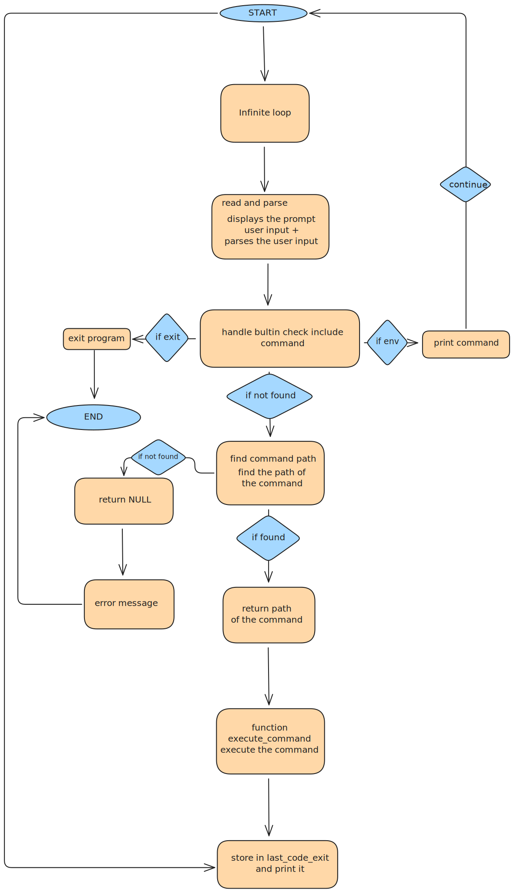

# Simple_shell

[](README.md)                                       
[](man_pages/simple_shell.1.fr)

---

## C’est quoi ?

**Simple Shell** est une implémentation basique d’un interpréteur de commandes UNIX écrite en langage C.  
Le programme reproduit le comportement minimal d’un shell en affichant un prompt, en lisant l’entrée utilisateur et en exécutant les commandes à l’aide de `fork()` et `execve()`.

Ce projet a pour objectif de mieux comprendre les concepts fondamentaux de la programmation système UNIX tels que la gestion des processus, des variables d’environnement, du PATH et des erreurs.

---

## Fonctionnalités supportées

| Fonctionnalité | Description |
|---------------|-------------|
| Prompt interactif | Affiche un prompt et attend une commande utilisateur |
| Exécution de commandes | Utilise `fork()` et `execve()` |
| Commandes avec arguments | Gère les arguments passés aux commandes |
| Gestion du PATH | Recherche les exécutables via la variable PATH |
| Environnement | Passe `environ` à `execve()` |
| Built-in `exit` | Quitte le shell |
| Built-in `env` | Affiche l’environnement courant |
| Gestion des erreurs | Gère les commandes invalides et erreurs d’exécution |
| Gestion de l’EOF | Gère `Ctrl + D` (fin de fichier) |
| Optimisation | `fork()` n’est pas appelé si la commande n’existe pas |

---

## Flowchart



---

## Prérequis

- **OS** : Ubuntu 20.04 LTS
- **Compilateur** : GCC 9.4.0 ou supérieur
- **Éditeur** : vi, vim, emacs ou VS Code
- **Git** : Gestion du versioning
- **Style** : Code conforme à la norme Betty

---

## Comment compiler ?

```bash
gcc -Wall -Werror -Wextra -pedantic -std=gnu89 *.c -o simple_shell
```
---
## Exemples d'utilisation
```bash
$ ./simple_shell
$ ls
AUTHORS  README.md  simple_shell
$ pwd
/home/user/simple_shell
$ env
PATH=/usr/bin:/bin
HOME=/home/user
$ exit
```
---
## Gestion des erreurs

- Si une commande n’est pas trouvée, un message d’erreur est affiché
- Le shell continue de fonctionner après une erreur
- Aucun processus n’est créé si la commande est invalide

Exemple: 
```bash
$ wrong_command
./simple_shell: 1: wrong_command: not found
```

---
## Tests avec Valgrind
Pour vérifier l'absence de fuites mémoire:

```bash
# Compilation
gcc -Wall -Werror -Wextra -pedantic -std=gnu89 -g *.c -o simple_shell

# Lancement de valgrind
valgrind --leak-check=full --show-leak-kinds=all --track-origins=yes ./simple_shell
```
## Résultat attendu
```
==75837== HEAP SUMMARY:
==75837==     in use at exit: 0 bytes in 0 blocks
==75837==   total heap usage: 2 allocs, 2 frees, 1,144 bytes allocated
==75837== 
==75837== All heap blocks were freed -- no leaks are possible
==75837== 
==75837== For lists of detected and suppressed errors, rerun with: -s
==75837== ERROR SUMMARY: 0 errors from 0 contexts (suppressed: 0 from 0)
```
---

##Pages de manuel (man)
```bash
# Version anglaise
man ./man_pages/simple_shell.1.en

# Version française
man ./man_pages/simple_shell.1.fr
```
---
## Fichiers du projet
| Fichier | Description |
|------|-------------|
| `Simple_main.c` | Point d’entrée du shell, boucle principale et affichage du prompt |
| `env_command.c` | Implémentation du built-in `env` | 
| `execute_command.c` | Création des processus et exécution des commandes avec `fork()` et `execve()` |
| `find_path.c` | Recherche des exécutables via la variable PATH |
| `read_and_parse.c` | Lecture de l’entrée utilisateur et découpage de la ligne de commande |
| `main.h` | Prototypes des fonctions, macros et structures partagées |

---
## Comment ça fonctionne ? 
1. Le shell affiche un prompt
2. Il lit l’entrée utilisateur
3. La ligne de commande est analysée et découpée
4. Le PATH est parcouru pour trouver l’exécutable
5. Si la commande existe :
6. `fork()` est appelé
7. `execve()` exécute la commande
8. Le processus parent attend la fin du processus fils
9. Le prompt est affiché à nouveau

--- 
## Auteurs

- Auxance JOURDAN
- Julien HINLANG

---

*Projet école Holberton*


